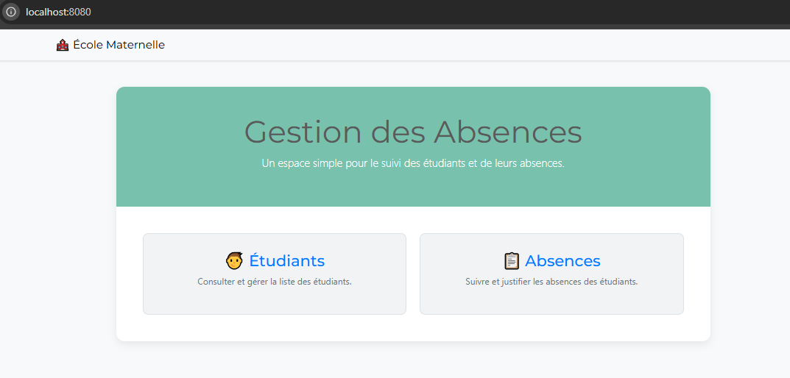
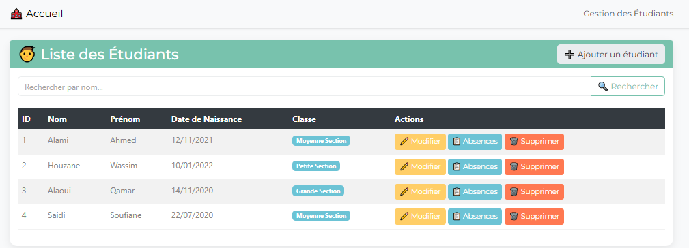
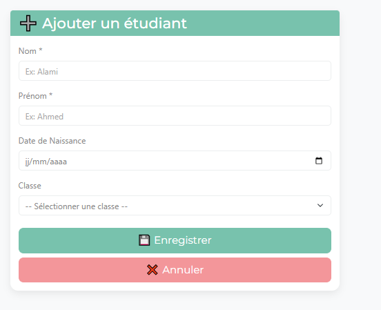
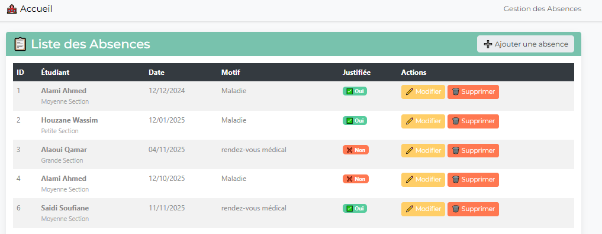
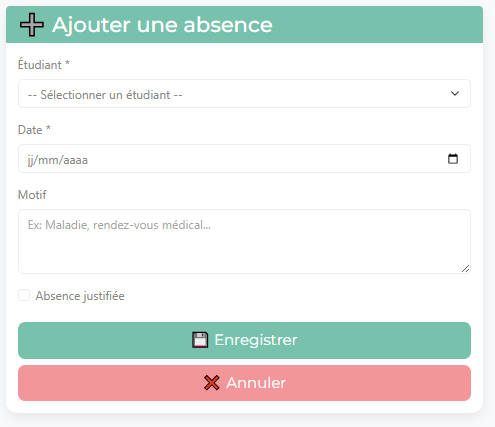

# 📚 Mise en place d’une application web MVC Spring

[](https://spring.io/projects/spring-boot)
[](https://www.oracle.com/java/)
[](https://www.mysql.com/)
[](https://www.thymeleaf.org/)

## 🎯 Présentation du projet

### Objectif

Développer une application web complète pour la gestion des absences des étudiants d'une école maternelle en utilisant le framework Spring Boot et l'architecture MVC (Model-View-Controller).


## 🏗️ Architecture de l'application

### Pattern MVC (Model-View-Controller)

L'application suit le pattern architectural MVC qui sépare les responsabilités en trois couches :

```
┌─────────────────────────────────────────────────────────┐
│                    PRÉSENTATION                         │
│              (Vues Thymeleaf - HTML)                    │
│   ┌──────────┐  ┌──────────┐  ┌──────────┐              │
│   │ index.html│  │list.html │  │form.html │             │
│   └──────────┘  └──────────┘  └──────────┘              │
└─────────────────────────────────────────────────────────┘
                         ▲
                         │ HTTP Request/Response
                         ▼
┌─────────────────────────────────────────────────────────┐
│                    CONTRÔLEURS                          │
│              (Spring MVC Controllers)                   │
│   ┌───────────────┐  ┌───────────────┐                  │
│   │EtudiantCtrl   │  │AbsenceCtrl    │                  │
│   └───────────────┘  └───────────────┘                  │
└─────────────────────────────────────────────────────────┘
                         ▲
                         │ Business Logic
                         ▼
┌─────────────────────────────────────────────────────────┐
│                    SERVICES                             │
│              (Business Logic Layer)                     │
│   ┌───────────────┐  ┌───────────────┐                  │
│   │EtudiantSvc    │  │AbsenceSvc     │                  │
│   └───────────────┘  └───────────────┘                  │
└─────────────────────────────────────────────────────────┘
                         ▲
                         │ Data Access
                         ▼
┌─────────────────────────────────────────────────────────┐
│                    REPOSITORIES                         │
│              (Spring Data JPA)                          │
│   ┌───────────────┐  ┌───────────────┐                  │
│   │EtudiantRepo   │  │AbsenceRepo    │                  │
│   └───────────────┘  └───────────────┘                  │
└─────────────────────────────────────────────────────────┘
                         ▲
                         │ JPA/Hibernate
                         ▼
┌─────────────────────────────────────────────────────────┐
│                BASE DE DONNÉES                          │
│                    (MySQL)                              │
│   ┌───────────────┐  ┌───────────────┐                  │
│   │  etudiant     │  │  absence      │                  │
│   └───────────────┘  └───────────────┘                  │
└─────────────────────────────────────────────────────────┘
```

### Couches applicatives détaillées

#### 1. **Couche Entités (Model)**
- Représente les tables de la base de données
- Utilise les annotations JPA pour le mapping objet-relationnel
- Définit les relations entre les entités (One-to-Many, Many-to-One)

**Responsabilités :**
- Structuration des données
- Définition des contraintes d'intégrité
- Gestion des relations entre entités

#### 2. **Couche Repository (Data Access)**
- Interface entre l'application et la base de données
- Hérite de `JpaRepository` pour les opérations CRUD automatiques
- Permet de définir des requêtes personnalisées

**Responsabilités :**
- Persistance des données
- Récupération des données
- Requêtes personnalisées

#### 3. **Couche Service (Business Logic)**
- Contient la logique métier de l'application
- Fait le lien entre les contrôleurs et les repositories
- Utilise l'injection de dépendances

**Responsabilités :**
- Traitement des données
- Validation des règles métier
- Orchestration des opérations

#### 4. **Couche Controller (Presentation Logic)**
- Gère les requêtes HTTP (GET, POST, etc.)
- Prépare les données pour les vues
- Retourne les pages HTML via Thymeleaf

**Responsabilités :**
- Routing des URLs
- Gestion des formulaires
- Préparation du modèle pour les vues

#### 5. **Couche Vue (User Interface)**
- Pages HTML utilisant Thymeleaf
- Affichage dynamique des données
- Formulaires pour les interactions utilisateur

**Responsabilités :**
- Interface utilisateur
- Affichage des données
- Collecte des inputs utilisateur

---

## 💻Dépendances utilisées
- Spring Web
- Spring Data JPA
- MySQL Driver
- Thymeleaf
- Lombok (optionnel mais pratique)
- Spring Boot DevTools


## ⚙️ Installation et configuration

### Étape 1 : Cloner le projet

```bash
git clone https://github.com/IkrameHouzane/Atelier6-SpringBoot-
cd Atelier6-SpringBoot-
```

### Étape 2 : Créer la base de données

Ouvrez MySQL en ligne de commande ou MySQL Workbench et exécutez :

```sql
CREATE DATABASE gestion_absences CHARACTER SET utf8mb4 COLLATE utf8mb4_unicode_ci;
```

### Étape 3 : Configurer application.properties

Ouvrez le fichier `src/main/resources/application.properties` et modifiez les paramètres suivants :

```properties
# Configuration de la base de données
spring.datasource.url=jdbc:mysql://localhost:3306/gestion_absences?createDatabaseIfNotExist=true
spring.datasource.username=root
spring.datasource.password=VOTRE_MOT_DE_PASSE

# Configuration JPA/Hibernate
spring.jpa.hibernate.ddl-auto=update
spring.jpa.show-sql=true
spring.jpa.properties.hibernate.dialect=org.hibernate.dialect.MySQLDialect
spring.jpa.properties.hibernate.format_sql=true

# Configuration Thymeleaf
spring.thymeleaf.cache=false
spring.thymeleaf.enabled=true
spring.thymeleaf.prefix=classpath:/templates/
spring.thymeleaf.suffix=.html

# Configuration du serveur
server.port=8080
```

#### Explications des paramètres :

**Base de données :**
- `spring.datasource.url` : URL de connexion à MySQL
- `createDatabaseIfNotExist=true` : Crée la base si elle n'existe pas
- `spring.datasource.username` : Nom d'utilisateur MySQL
- `spring.datasource.password` : Mot de passe MySQL

**JPA/Hibernate :**
- `spring.jpa.hibernate.ddl-auto=update` : Met à jour le schéma automatiquement
    - `create` : Recrée les tables à chaque démarrage
    - `update` : Met à jour sans supprimer les données
    - `validate` : Valide le schéma seulement
    - `none` : Aucune action
- `spring.jpa.show-sql=true` : Affiche les requêtes SQL dans la console
- `spring.jpa.properties.hibernate.format_sql=true` : Formate les requêtes SQL

**Thymeleaf :**
- `spring.thymeleaf.cache=false` : Désactive le cache en développement
- `spring.thymeleaf.prefix` : Chemin des templates
- `spring.thymeleaf.suffix` : Extension des fichiers

### Étape 4 : Importer le projet dans IntelliJ IDEA

1. Ouvrez IntelliJ IDEA
2. Cliquez sur **File → Open**
3. Sélectionnez le dossier du projet
4. Attendez que Maven télécharge toutes les dépendances (visible dans la barre de progression en bas)

### Étape 5 : Vérifier les dépendances Maven

Ouvrez le fichier `pom.xml` et vérifiez que toutes les dépendances sont présentes :

```xml
<dependencies>
    <!-- Spring Boot Starter Web -->
    <dependency>
        <groupId>org.springframework.boot</groupId>
        <artifactId>spring-boot-starter-web</artifactId>
    </dependency>
    
    <!-- Spring Boot Starter Data JPA -->
    <dependency>
        <groupId>org.springframework.boot</groupId>
        <artifactId>spring-boot-starter-data-jpa</artifactId>
    </dependency>
    
    <!-- MySQL Driver -->
    <dependency>
        <groupId>com.mysql</groupId>
        <artifactId>mysql-connector-j</artifactId>
        <scope>runtime</scope>
    </dependency>
    
    <!-- Thymeleaf -->
    <dependency>
        <groupId>org.springframework.boot</groupId>
        <artifactId>spring-boot-starter-thymeleaf</artifactId>
    </dependency>
    
    <!-- Lombok -->
    <dependency>
        <groupId>org.projectlombok</groupId>
        <artifactId>lombok</artifactId>
        <optional>true</optional>
    </dependency>
    
    <!-- Spring Boot DevTools -->
    <dependency>
        <groupId>org.springframework.boot</groupId>
        <artifactId>spring-boot-devtools</artifactId>
        <scope>runtime</scope>
        <optional>true</optional>
    </dependency>
</dependencies>
```

### Étape 6 : Lancer l'application

**Méthode 1 : Depuis IntelliJ IDEA**
1. Ouvrez la classe principale `Atelier6Application.java`
2. Cliquez sur le bouton ▶️ vert à gauche de la méthode `main`


### Étape 7 : Accéder à l'application

Ouvrez votre navigateur et allez sur :
```
http://localhost:8080
```

---


## 🔨 Étapes de développement

### Étape 1 : Conception du diagramme de classe

**Objectif :** Définir la structure des données et les relations entre entités.

#### Diagramme de classe UML

```
┌─────────────────────────────────────────┐
│            Etudiant                     │
├─────────────────────────────────────────┤
│ - id: Long (PK)                         │
│ - nom: String                           │
│ - prenom: String                        │
│ - dateNaissance: Date                   │
│ - classe: String                        │ 
└─────────────────────────────────────────┘
           │ 1
           │ 
           │
           │ * possède
           ▼
┌─────────────────────────────────────────┐
│            Absence                      │
├─────────────────────────────────────────┤
│ - id: Long (PK)                         │
│ - date: Date                            │
│ - motif: String                         │
│ - justifiee: Boolean                    │ 
└─────────────────────────────────────────┘
```

#### Relations

- **Relation One-to-Many** : Un étudiant peut avoir plusieurs absences
- **Relation Many-to-One** : Plusieurs absences appartiennent à un étudiant
- **Cardinalité** : 1..* (un étudiant, zéro ou plusieurs absences)

#### Contraintes d'intégrité

1. Un étudiant doit avoir un nom et un prénom
2. Une absence doit être liée à un étudiant existant
3. Une absence doit avoir une date
4. La suppression d'un étudiant entraîne la suppression de ses absences (cascade)

---

### Étape 2 : Création des entités JPA

**Objectif :** Transformer le diagramme de classe en classes Java annotées JPA.

#### Annotations JPA utilisées

| Annotation | Description | Usage |
|-----------|-------------|-------|
| `@Entity` | Marque la classe comme entité JPA | Sur la classe |
| `@Table` | Personnalise le nom de la table | Sur la classe |
| `@Id` | Définit la clé primaire | Sur l'attribut ID |
| `@GeneratedValue` | Stratégie de génération de l'ID | Sur l'attribut ID |
| `@Column` | Personnalise la colonne | Sur les attributs |
| `@Temporal` | Type de date (DATE, TIME, TIMESTAMP) | Sur les dates |
| `@OneToMany` | Relation un-à-plusieurs | Sur la collection |
| `@ManyToOne` | Relation plusieurs-à-un | Sur l'objet |
| `@JoinColumn` | Colonne de jointure (clé étrangère) | Sur la relation |

#### Entité Etudiant

**Caractéristiques :**
- Identifiant auto-généré
- Nom et prénom obligatoires (max 50 caractères)
- Date de naissance optionnelle
- Classe optionnelle (max 30 caractères)
- Liste d'absences (relation bidirectionnelle)

**Stratégies de récupération :**
- `FetchType.LAZY` : Les absences ne sont chargées que si on y accède
- `CascadeType.ALL` : Toutes les opérations se propagent aux absences

#### Entité Absence

**Caractéristiques :**
- Identifiant auto-généré
- Date obligatoire
- Motif optionnel (max 200 caractères)
- Justifiée (booléen, par défaut false)
- Référence vers l'étudiant (clé étrangère)

**Relation :**
- `@ManyToOne` : Plusieurs absences pour un étudiant
- `@JoinColumn(name = "etudiant_id")` : Crée la colonne de clé étrangère

---

### Étape 3 : Création de la couche Repository

**Objectif :** Définir les interfaces d'accès aux données.

#### Spring Data JPA

Spring Data JPA fournit automatiquement les implémentations des repositories. Il suffit de créer des interfaces qui héritent de `JpaRepository`.

#### Méthodes CRUD automatiques

En héritant de `JpaRepository<T, ID>`, on obtient gratuitement :

| Méthode | Description |
|---------|-------------|
| `save(T entity)` | Enregistre ou met à jour une entité |
| `findById(ID id)` | Trouve une entité par son ID |
| `findAll()` | Retourne toutes les entités |
| `deleteById(ID id)` | Supprime une entité par son ID |
| `delete(T entity)` | Supprime une entité |
| `count()` | Compte le nombre d'entités |
| `existsById(ID id)` | Vérifie si une entité existe |

#### Méthodes personnalisées

Spring Data JPA génère automatiquement les requêtes SQL en se basant sur le nom des méthodes :

**Conventions de nommage :**

| Mot-clé | SQL équivalent | Exemple |
|---------|----------------|---------|
| `findBy` | `SELECT ... WHERE` | `findByNom(String nom)` |
| `And` | `AND` | `findByNomAndPrenom(...)` |
| `Or` | `OR` | `findByNomOrPrenom(...)` |
| `Containing` | `LIKE %...%` | `findByNomContaining(...)` |
| `IgnoreCase` | `LOWER(...)` | `findByNomIgnoreCase(...)` |
| `OrderBy` | `ORDER BY` | `findByClasseOrderByNom(...)` |


---

### Étape 4 : Création de la couche Service

**Objectif :** Implémenter la logique métier et faire le lien entre contrôleurs et repositories.

#### Architecture du service

```
┌──────────────────────────────────────────────┐
│        EtudiantService (Interface)           │
│  - Définit le contrat du service             │
│  - Méthodes abstraites                       │
└──────────────────────────────────────────────┘
                    ▲
                    │ implémente
                    │
┌──────────────────────────────────────────────┐
│      EtudiantServiceImpl (Classe)            │
│  - Implémente la logique métier              │
│  - Utilise EtudiantRepository                │
│  - Gère les exceptions                       │
└──────────────────────────────────────────────┘
```

#### Pourquoi utiliser une interface ?

1. **Séparation des responsabilités** : Le contrat (interface) est séparé de l'implémentation
2. **Testabilité** : Facilite les tests unitaires (mocking)
3. **Flexibilité** : Permet de changer d'implémentation facilement
4. **Bonne pratique Spring** : Respecte les principes SOLID

#### Injection de dépendances

**Principe :**
Spring gère automatiquement la création et l'injection des objets (beans).

```java
@Service
public class EtudiantServiceImpl implements EtudiantService {
    
    @Autowired
    private EtudiantRepository etudiantRepository;
    
    // Spring injecte automatiquement l'instance du repository
}
```
Mais vu que ce n'est pas une bonne pratique, on a refactorisé les contrôleurs et les services pour utiliser l'injection de dépendances par constructeur avec Lombok, ce qui est une bonne pratique.


### Étape 5 : Création de la couche Controller

**Objectif :** Gérer les requêtes HTTP et retourner les vues appropriées.

#### Annotations Spring MVC

| Annotation | Description | Exemple |
|-----------|-------------|---------|
| `@Controller` | Marque la classe comme contrôleur | `@Controller` |
| `@RequestMapping` | Préfixe pour toutes les URLs | `@RequestMapping("/etudiants")` |
| `@GetMapping` | Gère les requêtes GET | `@GetMapping` |
| `@PostMapping` | Gère les requêtes POST | `@PostMapping` |
| `@PathVariable` | Récupère une variable dans l'URL | `@PathVariable Long id` |
| `@RequestParam` | Récupère un paramètre de requête | `@RequestParam String nom` |
| `@ModelAttribute` | Lie les données du formulaire | `@ModelAttribute Etudiant etudiant` |

#### Flux d'une requête HTTP

```
1. Utilisateur clique sur un lien ou soumet un formulaire
         ▼
2. Navigateur envoie une requête HTTP (GET ou POST)
         ▼
3. Spring MVC intercepte la requête
         ▼
4. Le contrôleur approprié est appelé
         ▼
5. Le contrôleur appelle le service
         ▼
6. Le service appelle le repository
         ▼
7. Les données sont récupérées/sauvegardées en base
         ▼
8. Le contrôleur prépare le modèle (Model)
         ▼
9. Le contrôleur retourne le nom de la vue
         ▼
10. Thymeleaf génère le HTML
         ▼
11. Le HTML est envoyé au navigateur
```

#### Exemples de mappings

**Liste des étudiants :**
```
URL : GET /etudiants
Contrôleur : EtudiantController.listEtudiants()
Vue : templates/etudiants/list.html
```

**Formulaire d'ajout :**
```
URL : GET /etudiants/nouveau
Contrôleur : EtudiantController.showAddForm()
Vue : templates/etudiants/form.html
```

**Enregistrement :**
```
URL : POST /etudiants/sauvegarder
Contrôleur : EtudiantController.saveEtudiant()
Redirection : redirect:/etudiants
```

**Modification :**
```
URL : GET /etudiants/modifier/5
Contrôleur : EtudiantController.showEditForm(5)
Vue : templates/etudiants/form.html (pré-rempli)
```

**Suppression :**
```
URL : GET /etudiants/supprimer/5
Contrôleur : EtudiantController.deleteEtudiant(5)
Redirection : redirect:/etudiants
```

#### Objet Model

Le `Model` permet de passer des données du contrôleur vers la vue :

```java
@GetMapping
public String listEtudiants(Model model) {
    model.addAttribute("etudiants", etudiantService.getAllEtudiants());
    return "etudiants/list";
}
```

**Dans la vue Thymeleaf :**
```html
<tr th:each="etudiant : ${etudiants}">
    <td th:text="${etudiant.nom}"></td>
</tr>
```

---

### Étape 6 : Création des vues Thymeleaf

**Objectif :** Créer les interfaces utilisateur pour interagir avec l'application.

#### Thymeleaf : qu'est-ce que c'est ?

Thymeleaf est un moteur de templates Java qui permet de générer du HTML dynamique côté serveur.

**Caractéristiques :**
- Syntaxe naturelle (HTML valide)
- Intégration parfaite avec Spring
- Support des formulaires
- Expression Language puissant

#### Syntaxe Thymeleaf de base

| Syntaxe | Description | Exemple |
|---------|-------------|---------|
| `th:text` | Affiche du texte | `<p th:text="${etudiant.nom}"></p>` |
| `th:each` | Boucle for | `<tr th:each="e : ${etudiants}">` |
| `th:if` | Condition if | `<div th:if="${etudiant.id != null}">` |
| `th:unless` | Condition if not | `<div th:unless="${list.isEmpty()}">` |
| `th:href` | Lien dynamique | `<a th:href="@{/etudiants/{id}(id=${e.id})}">` |
| `th:field` | Lier un champ de formulaire | `<input th:field="*{nom}">` |
| `th:object` | Objet du formulaire | `<form th:object="${etudiant}">` |
| `th:action` | Action du formulaire | `<form th:action="@{/etudiants/sauvegarder}">` |

#### Expressions Thymeleaf

**Variable expressions : `${...}`**
```html
<p th:text="${etudiant.nom}">Nom</p>
```

**Selection expressions : `*{...}`**
Utilisé dans les formulaires avec `th:object`
```html
<form th:object="${etudiant}">
    <input th:field="*{nom}"> <!-- Équivalent à ${etudiant.nom} -->
</form>
```

**Link expressions : `@{...}`**
Pour créer des URLs
```html
<a th:href="@{/etudiants}">Liste</a>
<a th:href="@{/etudiants/{id}(id=${etudiant.id})}">Voir</a>
```

**Utility expressions**
```html
<!-- Dates -->
<p th:text="${#dates.format(etudiant.dateNaissance, 'dd/MM/yyyy')}"></p>

<!-- Listes -->
<p th:if="${#lists.isEmpty(etudiants)}">Aucun étudiant</p>

<!-- Strings -->
<p th:text="${#strings.toUpperCase(etudiant.nom)}"></p>
```


#### Integration Bootstrap

Bootstrap est inclus via CDN pour le style :

```html
<link href="https://cdnjs.cloudflare.com/ajax/libs/bootstrap/5.3.0/css/bootstrap.min.css" rel="stylesheet">
```


## 🎯 Fonctionnalités

### Module Étudiants

#### 1. Lister tous les étudiants
- **URL :** `/etudiants`
- **Méthode HTTP :** GET
- **Description :** Affiche tous les étudiants dans un tableau
- **Informations affichées :**
    - ID
    - Nom et prénom
    - Date de naissance (format dd/MM/yyyy)
    - Classe (badge coloré)
    - Actions disponibles

#### 2. Ajouter un étudiant
- **URL :** `/etudiants/nouveau`
- **Méthode HTTP :** GET (formulaire), POST (enregistrement)
- **Champs du formulaire :**
    - Nom (obligatoire)
    - Prénom (obligatoire)
    - Date de naissance (optionnel)
    - Classe (select : Petite Section, Moyenne Section, Grande Section)
- **Validation :**
    - Champs obligatoires marqués avec *
    - Validation HTML5 (attribut `required`)

#### 3. Modifier un étudiant
- **URL :** `/etudiants/modifier/{id}`
- **Méthode HTTP :** GET (formulaire), POST (enregistrement)
- **Description :** Réutilise le même formulaire que l'ajout
- **Comportement :**
    - Le formulaire est pré-rempli avec les données existantes
    - L'ID est passé en champ caché
    - `save()` détecte automatiquement s'il s'agit d'une mise à jour

#### 4. Supprimer un étudiant
- **URL :** `/etudiants/supprimer/{id}`
- **Méthode HTTP :** GET
- **Description :** Supprime un étudiant et ses absences (cascade)
- **Confirmation :** Message JavaScript `confirm()` avant suppression
- **Redirection :** Retour à la liste après suppression

#### 5. Rechercher des étudiants
- **URL :** `/etudiants/rechercher?nom=xxx`
- **Méthode HTTP :** GET
- **Description :** Recherche par nom (insensible à la casse)
- **Comportement :**
    - Si le champ est vide, affiche tous les étudiants
    - Recherche avec `LIKE %nom%`

---

### Module Absences

#### 1. Lister toutes les absences
- **URL :** `/absences`
- **Méthode HTTP :** GET
- **Description :** Affiche toutes les absences dans un tableau
- **Informations affichées :**
    - ID de l'absence
    - Nom complet et classe de l'étudiant
    - Date de l'absence
    - Motif
    - Badge justifiée (✅ Oui / ❌ Non)
    - Actions disponibles

#### 2. Ajouter une absence
- **URL :** `/absences/nouveau`
- **Méthode HTTP :** GET (formulaire), POST (enregistrement)
- **Champs du formulaire :**
    - Étudiant (select obligatoire)
    - Date (obligatoire)
    - Motif (optionnel, textarea)
    - Justifiée (checkbox, par défaut false)
- **Liste déroulante :** Affiche tous les étudiants avec format "Nom Prénom (Classe)"

#### 3. Modifier une absence
- **URL :** `/absences/modifier/{id}`
- **Méthode HTTP :** GET (formulaire), POST (enregistrement)
- **Description :** Formulaire pré-rempli avec les données existantes
- **Possibilité de changer l'étudiant associé**

#### 4. Supprimer une absence
- **URL :** `/absences/supprimer/{id}`
- **Méthode HTTP :** GET
- **Confirmation :** Message JavaScript avant suppression
- **Redirection :** Retour à la liste après suppression

#### 5. Voir les absences d'un étudiant
- **URL :** `/absences/etudiant/{id}`
- **Méthode HTTP :** GET
- **Description :** Filtre les absences pour un étudiant spécifique
- **Affichage :** Tableau des absences + informations de l'étudiant

---


## 📸 Captures d'écran











---

## 👨‍💻 Auteur

**Nom :** Houzane Ikrame

**Établissement :** Université Abdelmalek Essaadi - FST Tanger  

**Filière :** LSI (Logiciels et Systèmes Intelligents)

**Encadrant :** Pr. ELAACHAK LOTFI  

**Date :** Novembre 2024

---
